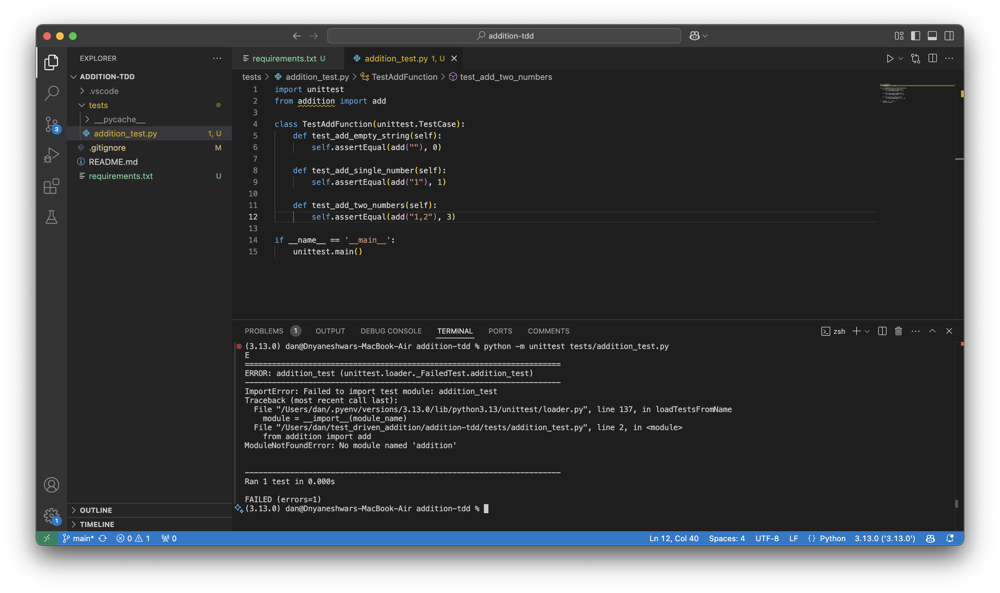
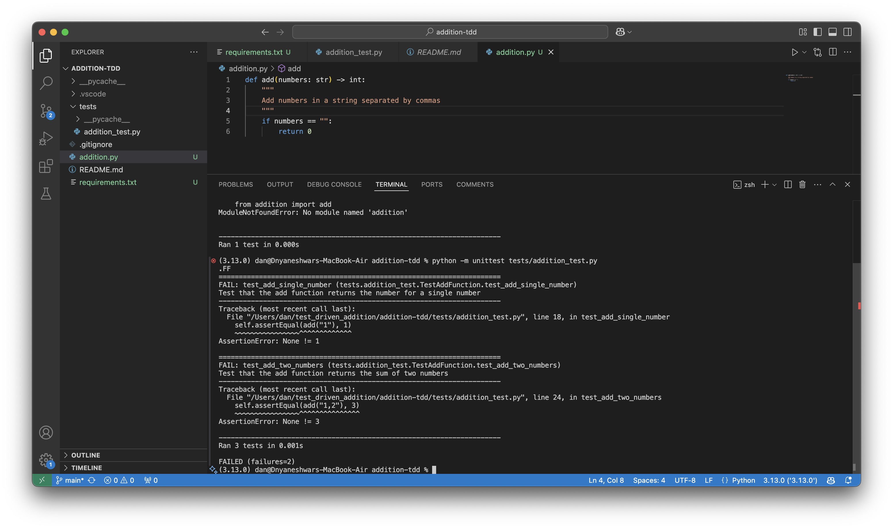
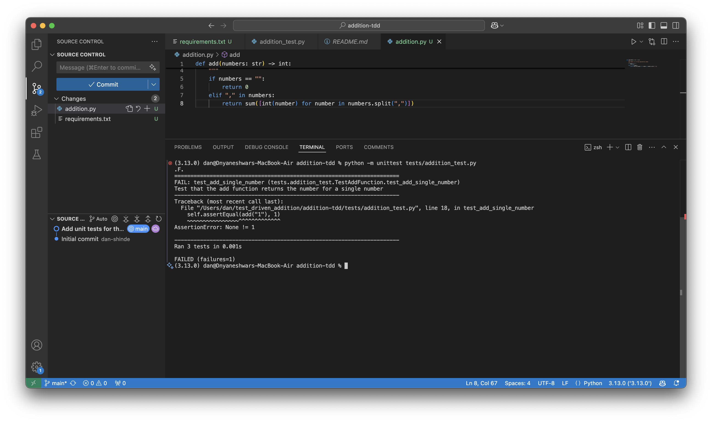
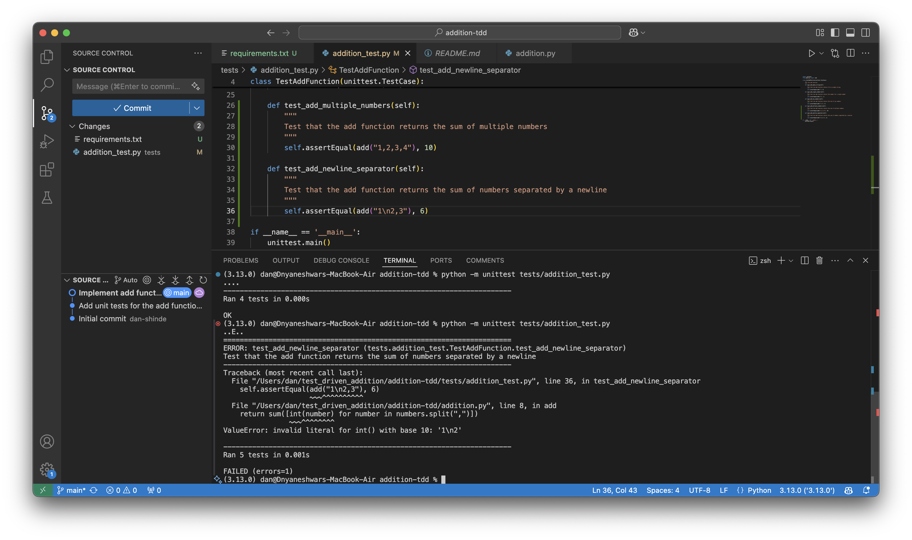

# Test-Driven Development (TDD) Approach

Test-Driven Development (TDD) is a software development process that relies on the repetition of a very short development cycle. The developer writes an initially failing automated test case that defines a desired improvement or new function, then produces the minimum amount of code to pass that test, and finally refactors the new code to acceptable standards.

## Here we have demonstrated implementing a add function using the TDD approch

### Step 1: Written basic unit tests
Here the tests are failing obviously because we have not written the add function yet

### Step 2: Made the first test pass
First unit test pass about returning addition 0 when string is blank

### Step 3: Second unit test pass

### Step 4: All basic unit tests pass
After implementing the addition logic all basic unit tests pass

### Step 5: Add unit tests for newline seperator(\n)
Here we have added one more unit test for testing if the add function can also return sum of numbers if the string contains \n as a seperator

### Step 6: Repeat
Similarly we did multiple repetations of writing failing unit tests and then made them pass by addiing a logic in the add function.

### Last Step: Refactor
We should refactor the code after each iteration but I did not found the scope of refactoring in initial repetations so in the end refactored the code so that it is readable and organized.

Please refer the screenshots in screenshots folder to track how we progressed.
